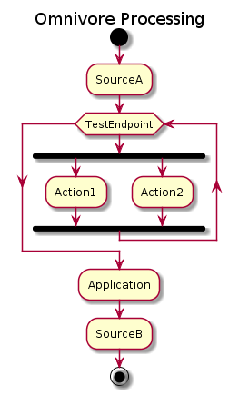

# Flow

The flow of messages through an omnivore application
is very straight forward:

1. A Source receives a new message.
2. The message is then passed to the Endpoint that owns the Source.
3. The Endpoint executes the message through all Actions registered within the Endpoint.
4. The Endpoint then passes the message to the Application.
5. The Application sends the message to the correct next destination.