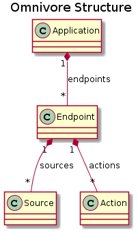

# Design - Structure

Omnivore is composed of four main components used for processing
messages:

* Applications
* Endpoints
* Sources
* Actions

## Visualization

Visualizing the relationship between these components can be useful
in understanding how messages are passed through the application:

***Application:*** Composed of endpoints

***Endpoint:*** Belongs to application. Composed of sources and actions.

***Source:*** Belongs to endpoint. Receives and transmits messages.

***Action:*** Belongs to endpoint. Performs task based on message.